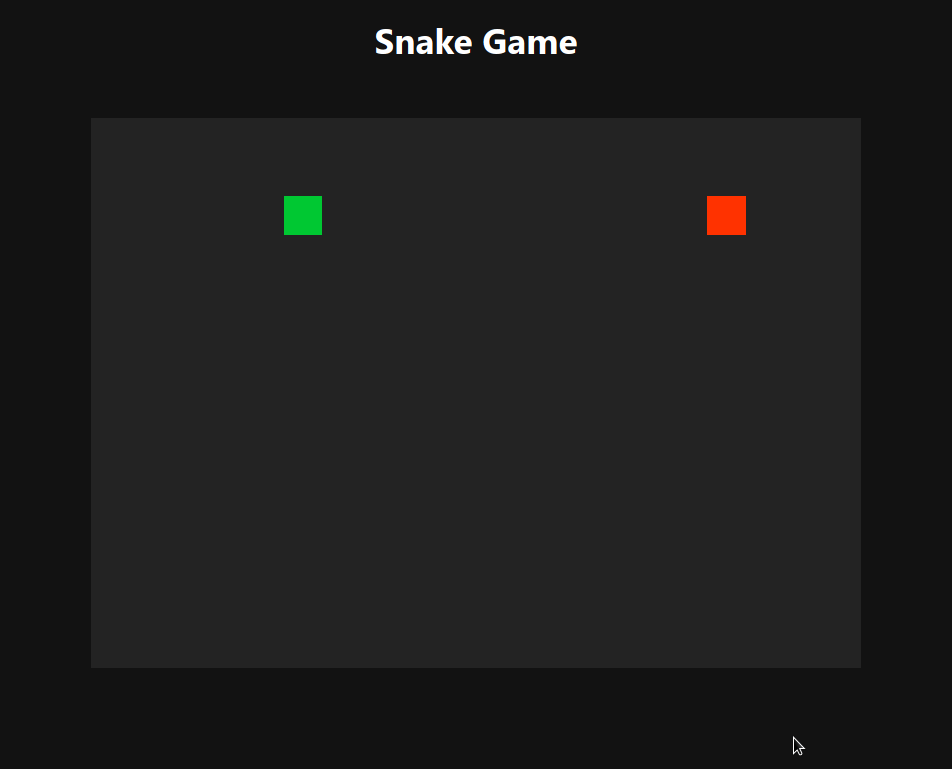

<h1 align="center">React Snake</h1>

 

    

> [Play](https://react-hooks-snake-game.netlify.app/) the game!

> This repo is based on [Quera SnappFood Contest](https://quera.ir/contest/assignments/20076/problems)

## Give me a Star

If you think this project is helpful just give me a ⭐️ Star is enough because i don't drink coffee 😃

## Contributing

Thank you for your interest in contributing! Please feel free to put up a PR for any issue or feature request.

## License

This project is licensed under the MIT License - see the [LICENSE.md](https://github.com/moh3n9595/react-snake/blob/master/LICENSE) file for details

